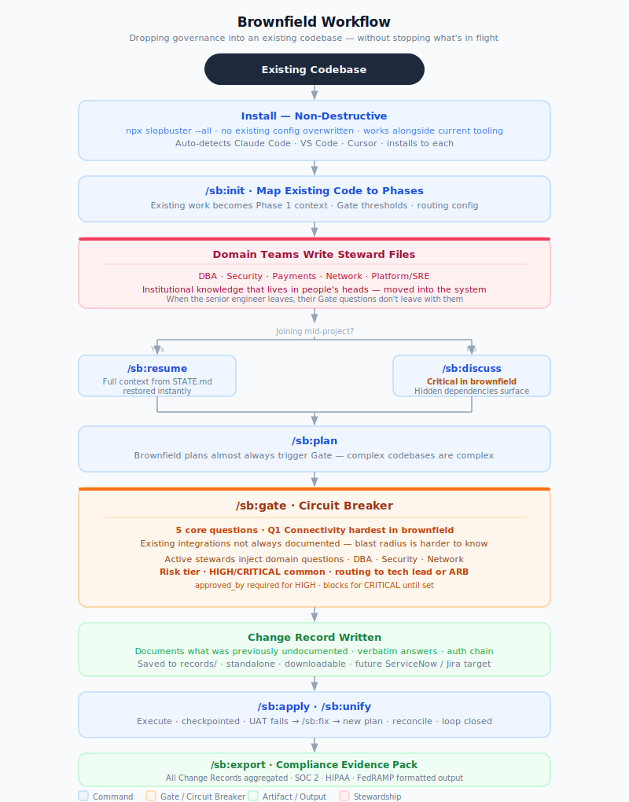

# Brownfield Workflow

Dropping SlopBuster governance into an existing codebase — without stopping what's in flight.

## What's different from greenfield

| | Greenfield | Brownfield |
|---|-----------|-----------|
| **Gate frequency** | Simple plans may auto-clear | Almost every plan triggers Gate — complexity is already there |
| **Stewardship** | Set up at init, grows with the project | Captures knowledge that currently lives in people's heads |
| **/sb:discuss** | Recommended | Critical — hidden dependencies are real |
| **Q1 Connectivity** | Known from the start | Harder — existing integrations not always documented |
| **Risk tier** | Tends LOW–MEDIUM early | Often HIGH–CRITICAL when touching existing systems |
| **Mid-project joins** | N/A | /sb:resume restores full context instantly |

## The stewardship payoff

The senior engineer who knows the database quirks, the network architect who understands the BGP failover behavior, the payments lead who knows the settlement window constraints — that knowledge currently lives in their heads.

Steward files move it into the system. When they leave, their Gate questions don't leave with them. Every future plan touching their domain inherits the institutional knowledge they wrote down.
