# Brownfield Workflow

Dropping SlopBuster governance into an existing codebase — without stopping what's in flight.

```mermaid
flowchart TD
    classDef cmd     fill:#2563EB,stroke:#1D4ED8,color:#fff
    classDef gate    fill:#EA580C,stroke:#C2410C,color:#fff
    classDef decide  fill:#7C3AED,stroke:#6D28D9,color:#fff
    classDef art     fill:#059669,stroke:#047857,color:#fff
    classDef steward fill:#DC2626,stroke:#B91C1C,color:#fff
    classDef cap     fill:#1E293B,stroke:#0F172A,color:#fff
    classDef warn    fill:#B45309,stroke:#92400E,color:#fff

    START(["🏗️  Existing Codebase"]):::cap

    subgraph ONBOARD ["  Onboarding — non-destructive  "]
        INSTALL["npx slopbuster --all\nInstalls alongside existing tooling\nNo existing config overwritten"]:::cmd
        INIT["/sb:init\nMaps existing code → phases\nGate thresholds · routing config"]:::cmd
        STEWARDS["Domain teams write steward files\nCaptures institutional knowledge\nthat lives in people's heads today"]:::steward
        INSTALL --> INIT --> STEWARDS
    end

    JOINER{"Joining a project\nalready in progress?"}:::decide
    RESUME["/sb:resume\nReads STATE.md\nFull context restored instantly"]:::cmd

    subgraph PLAN_LOOP ["  Plan → Gate → Apply → Unify  "]
        DISCUSS["/sb:discuss  ⚠️  Critical in brownfield\nHidden dependencies surface here\nBlast radius harder to know"]:::warn

        PLAN["/sb:plan\nBrownfield plans nearly always\ntrigger Gate — complex codebases are complex"]:::cmd

        GATE["/sb:gate  ·  Circuit Breaker\nQ1 Connectivity is hardest here:\nexisting integrations not always documented"]:::gate

        STEWARD_Q["Active stewards inject questions\nDBA owns DB questions\nSecurity owns auth questions\nNetwork owns infra questions"]:::steward

        RISK{"Risk tier\nbased on what's touched"}:::decide

        ROUTING["Routing advisory\n🟠 HIGH → tech lead approval\n🔴 CRITICAL → ARB before apply"]:::gate

        RECORD[("records/ · Change Record written\nDocuments what was\npreviously undocumented\nauth chain · verbatim answers")]:::art

        APPLY["/sb:apply\nWave by wave · checkpointed\nBoundaries protect existing files"]:::cmd

        PAUSE_RES["/sb:pause  →  /sb:resume\nSafe handoff between sessions\nor team members"]:::cmd

        UAT{"UAT\npasses?"}:::decide
        FIX["/sb:fix\nIssues scoped to their own\nplan + gate — no ad-hoc patches"]:::cmd

        UNIFY["/sb:unify\nSUMMARY.md · scope drift logged\nChange Record finalized"]:::cmd
    end

    EXPORT["/sb:export  soc2 · hipaa · fedramp\nAll change records aggregated\nCompliance evidence pack"]:::art

    DONE(["🔄  Governance active\nEvery future change gated"]):::cap

    START --> ONBOARD
    STEWARDS --> JOINER

    JOINER -- "Yes" --> RESUME --> DISCUSS
    JOINER -- "No" --> DISCUSS

    DISCUSS --> PLAN --> GATE
    GATE --> STEWARD_Q --> RISK
    RISK --> ROUTING --> RECORD --> APPLY

    APPLY -- "Checkpoint hit" --> PAUSE_RES --> APPLY
    APPLY --> UAT

    UAT -- "Fails" --> FIX --> PLAN
    UAT -- "Passes" --> UNIFY

    UNIFY -- "Next plan" --> PLAN
    UNIFY -- "Phase done" --> EXPORT --> DONE
```

## What's different from greenfield

| Greenfield | Brownfield |
|-----------|-----------|
| Simple plans may auto-clear the Gate | Almost every plan triggers Gate — complexity is already there |
| Stewards set up at init | Stewards capture knowledge that currently lives in people's heads |
| /sb:discuss is recommended | /sb:discuss is critical — hidden dependencies are real |
| Blast radius is known from the start | Q1 (Connectivity) is harder — existing integrations not always documented |
| Clean slate, no mid-project joins | /sb:resume means anyone can pick up exactly where things stand |
| Risk tier tends LOW–MEDIUM early on | Risk tier often HIGH–CRITICAL for brownfield (touching existing systems) |

## The stewardship payoff

In a brownfield project, the senior engineer who knows the database schema quirks, the network architect who understands the BGP failover behavior, the payments lead who knows the settlement window constraints — that knowledge currently lives in their heads.

Steward files move it into the system. When that engineer leaves, their questions don't leave with them. Every future plan touching their domain inherits the institutional knowledge they wrote down.
