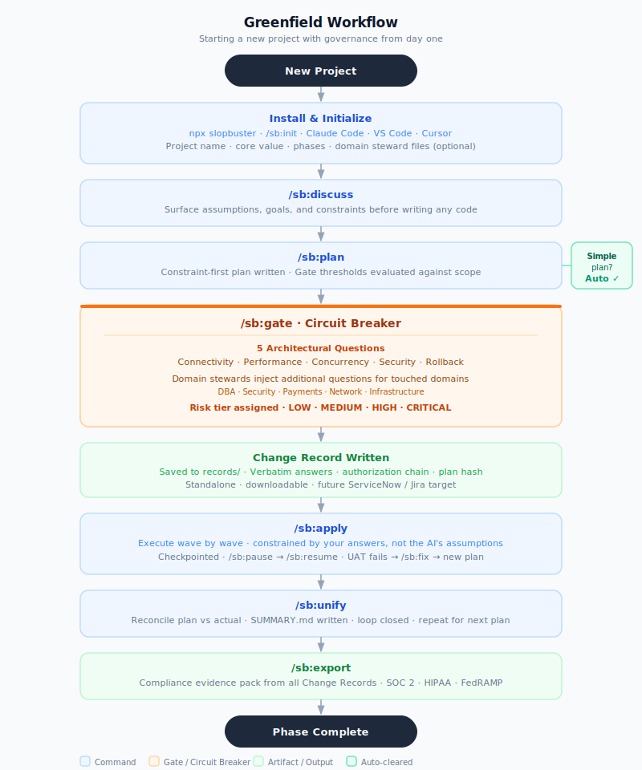

# Greenfield Workflow

Starting a new project with SlopBuster governance from day one.

## What each stage does

| Stage | What happens |
|-------|-------------|
| **Install & Initialize** | One-time. Auto-detects Claude Code, VS Code, Cursor. Domain steward files set up here — not retrofitted later. |
| **Discuss** | Surface assumptions and constraints before the plan is written. Cheaper to catch gaps here than mid-apply. |
| **Plan** | Gate thresholds evaluated against what you said you'd build. Simple plans auto-clear immediately. |
| **Gate** | 5 architectural questions + active steward questions from domain teams. Answers are verbatim — never summarized. Risk tier assigned. |
| **Change Record** | Written at gate clearance. Standalone document — shareable, downloadable, future ServiceNow/Jira target. |
| **Apply** | Executes against your answers, not the AI's assumptions. Checkpointed — safe to pause and resume. UAT fails → /sb:fix → new plan loop. |
| **Unify** | Closes the loop. Reconciles plan vs actual. SUMMARY.md written. Repeat for next plan in phase. |
| **Export** | Compliance evidence pack from all Change Records. SOC 2, HIPAA, FedRAMP formatted. |
