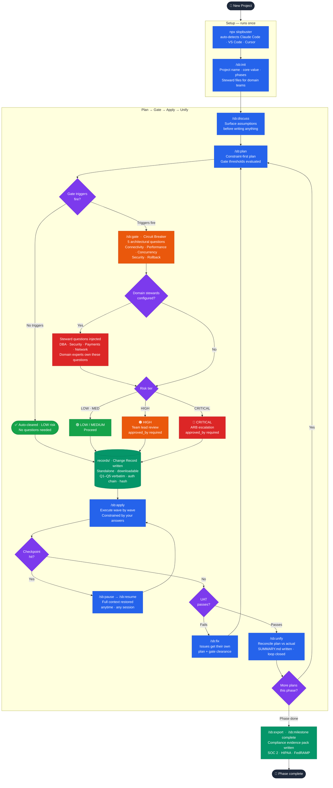

# Greenfield Workflow

Starting a new project with SlopBuster governance from day one.

## What this shows

| Stage | What happens |
|-------|-------------|
| **Setup** | One-time install + init. Steward files for domain teams set up here — not retrofitted later. |
| **Discuss** | Surface assumptions before the plan is written. Cheaper to catch gaps here than mid-apply. |
| **Plan** | Gate thresholds evaluated against what you said you'd build. Simple plans auto-clear. |
| **Gate** | 5 architectural questions + active steward questions. Answers are verbatim — never summarized. |
| **Risk tier** | LOW/MEDIUM proceed. HIGH routes to team lead. CRITICAL goes to ARB before apply. |
| **Change Record** | Written at gate clearance. Standalone document — shareable, downloadable, future ServiceNow/Jira target. |
| **Apply** | Executes against your answers, not the AI's assumptions. Checkpointed — safe to pause and resume. |
| **Unify** | Closes the loop. Documents what changed vs what was planned. Compliance evidence exportable. |
